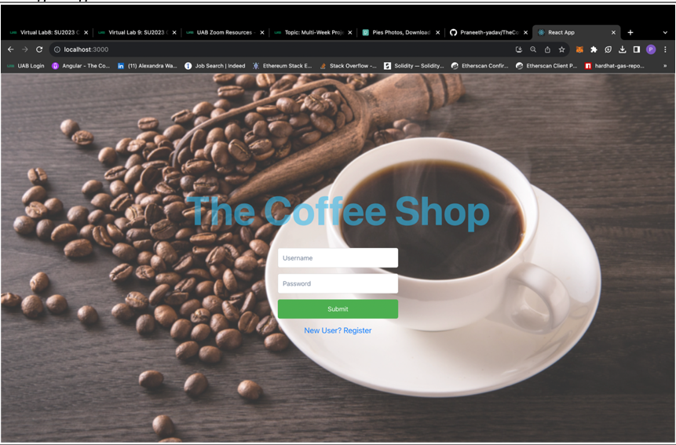
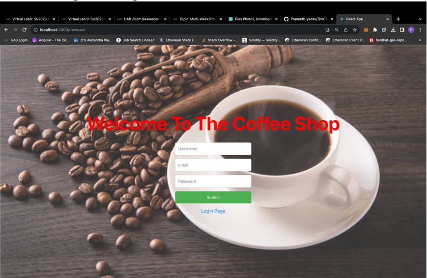
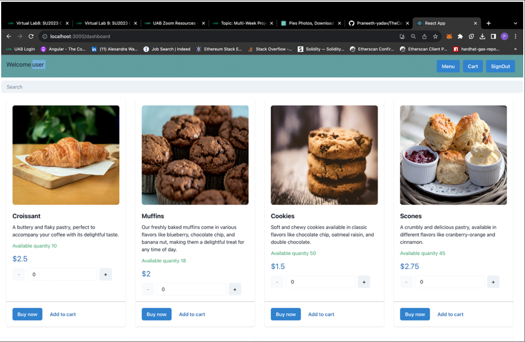
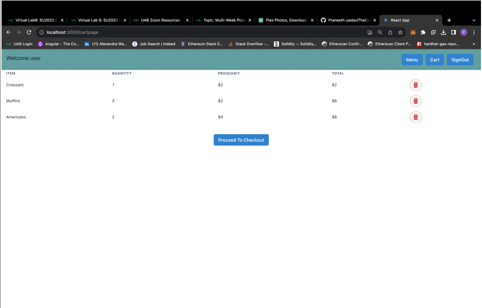
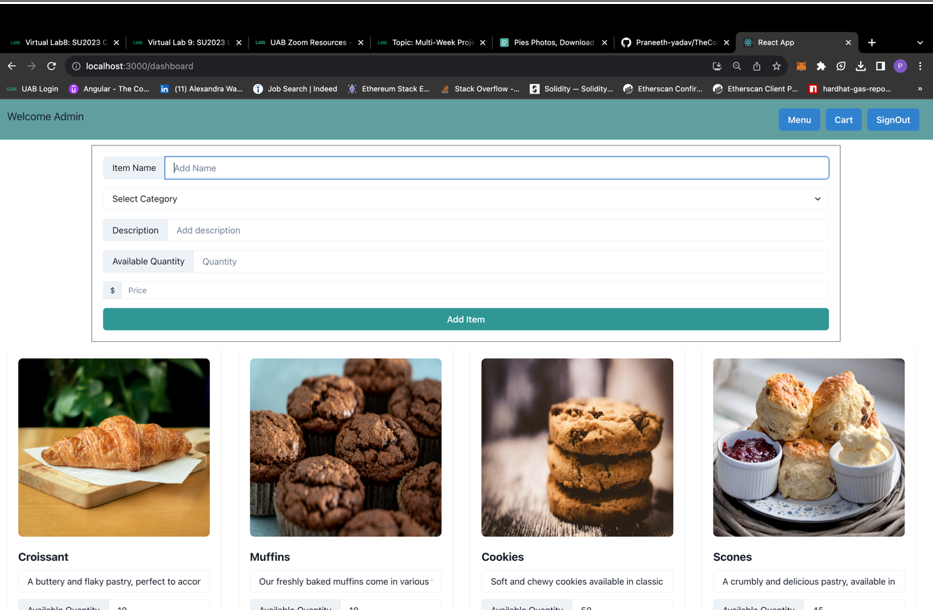
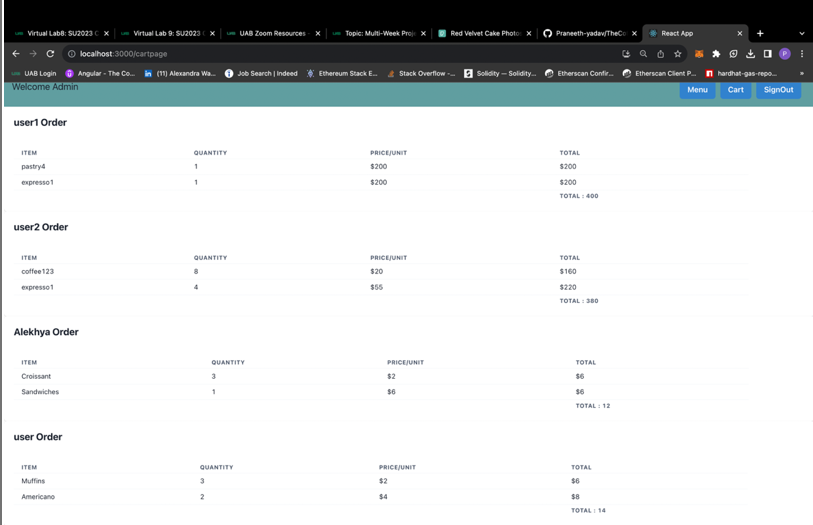

### The Coffee Shop

The goal of this project is to develop an online coffee shop application that enables customers to create accounts, place orders, and allows coffee shop managers to manage the shop's inventory, track orders, and maintain the overall operation efficiently. The application will provide a user-friendly interface for both customers and coffee shop managers, enhancing the overall coffee shop experience.

## Scripts

- Programming Language => JavaScript
- Frontend => React & Styled Components
- Framework => Flask
- Backend => MySQL

## Available Scripts

In the project directory, you can run:

# To start the FrontEnd React server navigate to myapp folder and perform

### `npm start`

Runs the app in the development mode.\
Open [http://localhost:3000](http://localhost:3000) to view it in your browser.

The page will reload when you make changes.\
You may also see any lint errors in the console.

# To start the BackEnd Flask server navigate to backend folder and perform

### `Conda activate`

Will activate the Conda virtual environment

### `python3 server.py`

Runs the Flask app in the development mode on port http://127.0.0.1:5000

### Project

## Home page

New user -> Register
Existing user -> Login

## Menu

-> Menu Items
-> User can search for item
-> Increment decrement buttons to select number of items to order

## Cart

## Admin Dashboard

-> Edit item description, item quantity, item price
-> Add new item or delete item

## Admin cart

Admin can view all the orders and their total price along with the customer name

